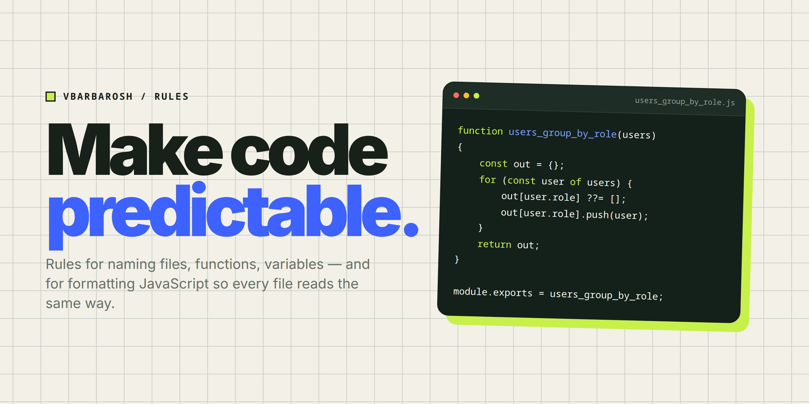

<p align="center">
<a href="https://opensource.org/licenses/MIT" rel="nofollow"></a>
<a href="https://github.com/vbarbarosh/rules" rel="nofollow"></a>
</p>

<picture>
  <source media="(prefers-color-scheme: dark)" srcset="img/cover-dark.png">
  
</picture>

# rules

Rules for naming, formatting, project layout and UI, so all code reads the same way.

## Quick start

Lint a folder with the rulebook's ESLint preset:

```
npx vbarbarosh/rules src
```

## Documentation

Full documentation: **[vbarbarosh.github.io/rules/docs/rules.html](https://vbarbarosh.github.io/rules/docs/rules.html)**

* [The rulebook](docs/README.md) — every rule document, the Vue 2 rules, the naming grammar and the glossaries
* [Formatting](FORMATTING.md) — the JavaScript formatting spec · [visual guide](https://vbarbarosh.github.io/rules/formatting.html)
* [Linting](LINTING.md) — the ESLint preset, its rules, and how to run it
* [Glossaries](https://vbarbarosh.github.io/rules/docs/glossaries.html) — every term, in one filterable page
* [Instructions for agents](https://vbarbarosh.github.io/rules/docs/agents.html) — what is expected of an agent, ready to paste into CLAUDE.md · [as Markdown](agents/)

## License

[MIT](LICENSE)
