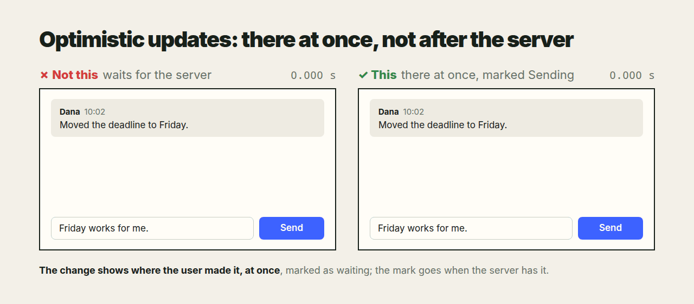

- Every task can be looked at from several sides. One is how it will work.
  Another is the user's: how they will use it. The same app can be looked at
  as its user, as its developer, and as someone who wants to break in, a
  hacker. These are separate stories, two or more parallel views of one
  thing.
- An example of a rule broken: optimistic UI. I answer from the thread, and
  I expect the answer to show at the bottom the same second. What happens:
  something blinks, and it is unclear where it went. Then it appears. Why?
  The message goes to incoming/ and waits for the agent to file it. But it
  already has its Re:, it is an answer to this thread, nothing to think
  about: it must be here. If the agent decides it belongs to another
  subject, the agent opens that subject and links this answer; the answer
  stays here, with a badge like "waiting". Yes, it has to reach incoming/
  for the agent to see it, but that kitchen is not mine to know. From my
  side it must be here at once.
- These stories must be named and written down, the way we have the pairs.
  Add your own suggestions to them. When the app is developed, the
  development is approached from each of these points of view.

# Every point of view

One task is several stories told side by side: how the user uses it, how it
is built, how someone would break it. An agent tells each story before
calling the work done, and the screen follows the user's story, whatever the
implementation does inside.

It is one case of [Consequences first](consequences_first.md).

Above, a comment sent under a task. In the implementation's story it goes
to the server, waits until it is filed, and comes back with the next
refresh, and that story is right. In the user's story they answered under
this task, and for two seconds the answer is nowhere. Both stories describe
the same click; only one was told while building it.

## Why

An agent builds from the implementation's story, because that is the one it
writes: files, queues, requests. The user lives in another story, of what
they did and what they see, and the attacker in a third, of what they can
reach. A defect in one story is invisible from the others: a correct queue
is a missing message on screen; a convenient endpoint is an open door. The
author finds each one by living that story, one message each.

## The points of view

Told by the author:

- **User.** What I do, what I see, what I expect next. The screen answers
  my action at once, where I acted; the route inside is not my business.
- **Implementation.** How it works: where data goes, in what order, what
  waits for what, what happens when a step fails.
- **Attacker.** What I can reach, read, change or flood that I should not:
  an input, a URL, a file name, a message that is also an instruction.

Suggested by the agent, for the author to confirm:

- **Operator.** It failed at night and I have the logs and the data folder:
  can I tell what happened, and restart it without losing anything?
- **Next developer.** I open the code a year from now: can I find where this
  lives, read why it is so, and change it without breaking the rest?
- **Newcomer.** I see it the first time, with no context: does the screen
  say what it is, what to do, and what just happened?

## The rule

1. **Tell each story before the first edit.** One or two lines each, in the
   person's words: "I click, my answer is under the last message". A view
   that does not apply is skipped, not forgotten.
2. **The screen follows the user's story.** When the implementation takes a
   longer way (a queue, an inbox, a second agent), the user still sees the
   result where they acted, at once, marked as pending until the way ends.
   The route stays inside.
3. **Each story gets its test.** The user's story is an e2e test of what
   the screen shows and when; the attacker's is a test of what is refused.
4. **Report by story.** The reply says what each view found, and what was
   changed for it, so the author need not read the work through each pair
   of eyes again.
