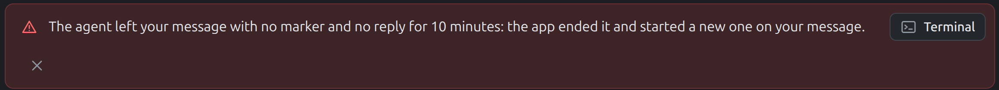

- Another example: a UI done as asked, with nothing checked.
- Why is this alert like this? Why is the close cross at the bottom? It is
  normally at the top right. Why did it jump down? Probably the message is
  too long. Before, the sidebar showed through as well.
- When such a UI is made, can it not be tested in its different states?
  Before saying "done", test it. What if the title is too long? What if
  there is none? What if it is one letter? What if the other parts shown
  have absurd values? What happens in all these cases?
- Then make the layout so that it takes them into account.
- This should go without saying.
- Look at these states and say: here it may be like this, here like that.
  "I made this decision; so this is decided now; I am letting you know."
  "Here I could not decide at all, it is utterly ambiguous; I need a
  confirmation to resolve this conflict." That is how it should be done.
  Any other way wears the author out.

# Every state before done

A piece of UI is not done when it looks right with the one text it was built
with. It is done when it holds with every text and value it will be given.
The agent tries those before saying "done", not the author after.
It is one case of [Consequences first](consequences_first.md).

The alert above was built with a short message. A long one took the whole
row, and the close button wrapped to a line of its own, under the text. One
long message in a test would have shown it.

## Why

The author sees the UI with real data, and real data is never the sample
the agent typed: a name is long, a title is missing, a count is zero or a
million. Each of those breaks a layout made for the sample, and each break
costs the author a screenshot and a message. Trying the states takes the
agent minutes; finding them one by one takes the author days.

## The rule

1. **List the states before calling it done.** For every text and value the
   element shows:
   - too long: a title of three lines, a word with no spaces, a path, a URL;
   - missing: empty, `null`, no title at all;
   - tiny: one letter, one item;
   - absurd: zero, negative, a million, a date years away;
   - and the element's own states: loading, error, disabled, many at once.
2. **Render each one and look.** A screenshot of each state, or one page
   with all of them side by side. A state that was not rendered was not
   tested.
3. **Make the layout hold them.** Fixed parts keep their place: a close
   button stays top right however long the text, a long text wraps or
   ellipsizes inside its own column, an empty one collapses or shows a
   placeholder. Nothing overlaps, nothing is pushed out of view, nothing
   shows through from behind.
4. **Keep the states in a test.** The crowded case goes into the e2e test,
   with an assertion that nothing overlaps, so the next change does not
   break it again unseen.
5. **Report what each state led to.** The reply names the states rendered,
   with the screenshots, and sorts them in two:
   - **Decided, for your information.** A state with a clear answer is
     handled and said: "a title longer than the row is cut with an ellipsis;
     the full one is in the tooltip".
   - **Ambiguous, needs your confirmation.** A state with no clear answer is
     not guessed at quietly. It is put to the author as one question with
     the options: "an empty title: hide the header, or show 'Untitled'?".
