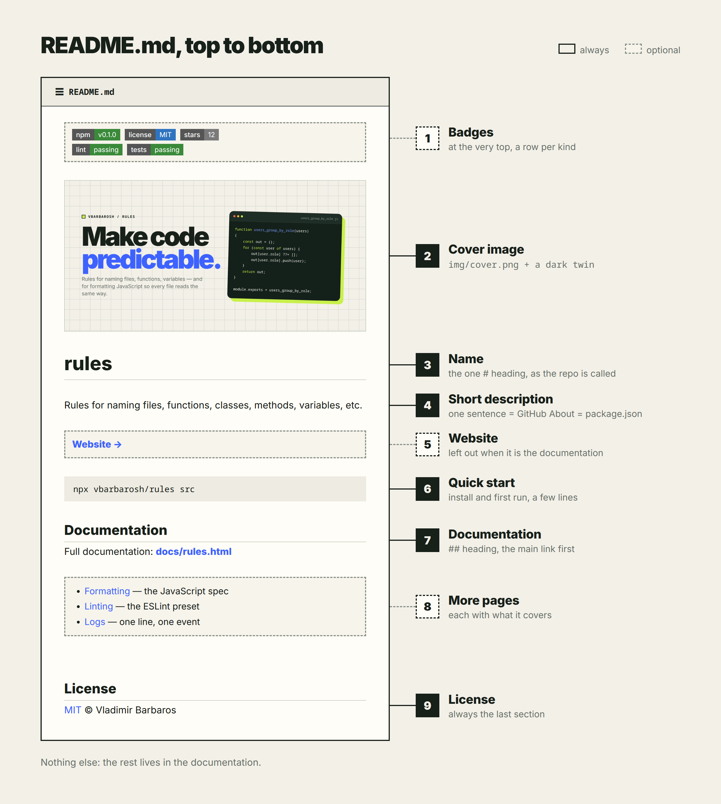
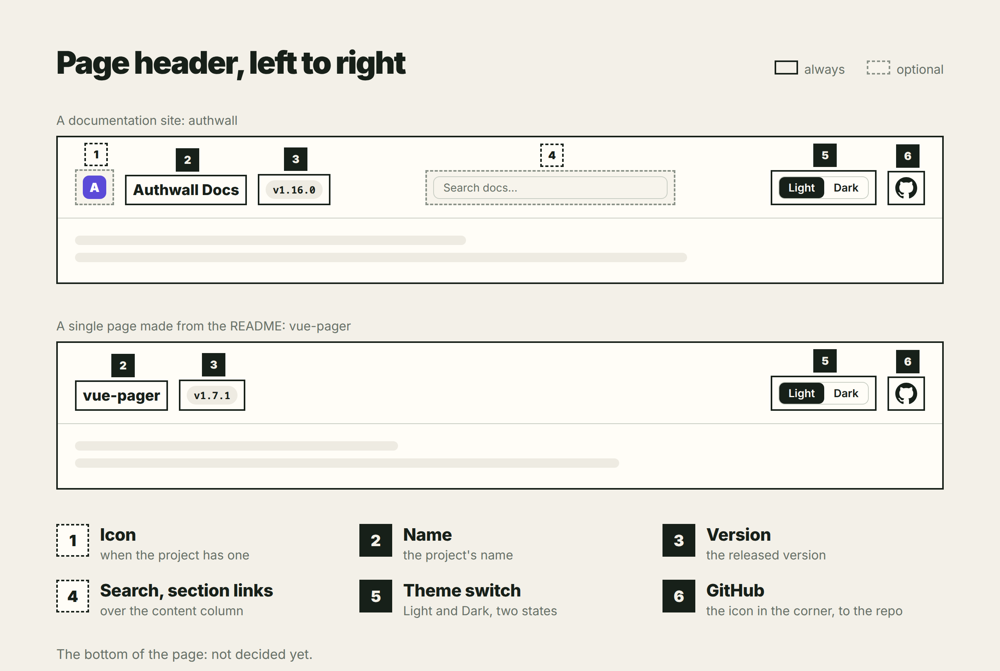
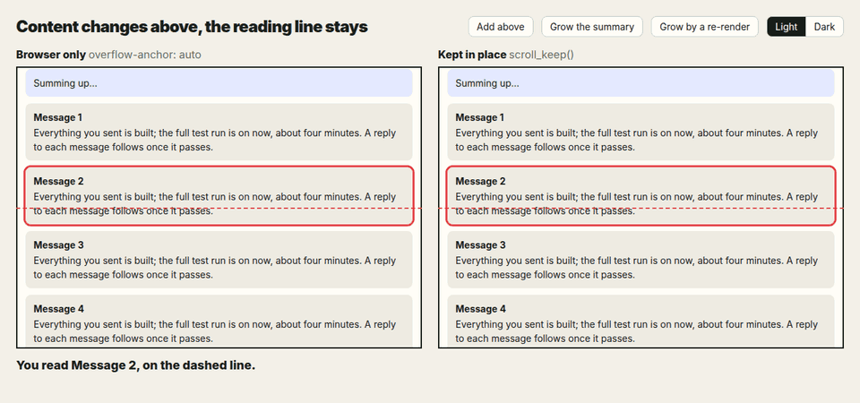
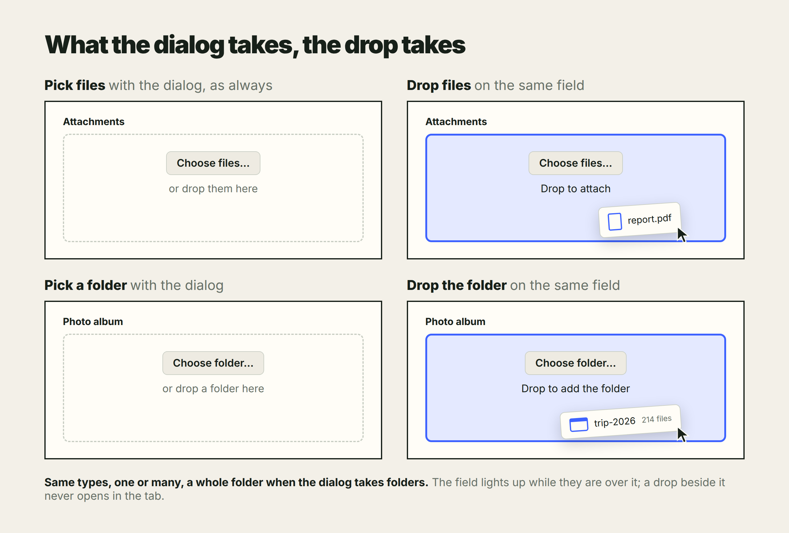
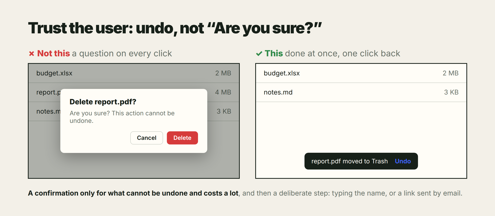

# The Rule Index

Every rule in this repository, stated once, in one table. Each row cites the
document it came from; that document stays the source of truth.

262 rules · 18 groups · 51 sources · filterable version: [rules.html](rules.html)

Codes match [rules.html](rules.html): a rule that page does not carry is
appended to the end of its group, and `LINT` is a group of its own.
Existing codes stay stable when a rule moves to another group.
In the canonical forms, `✓` and `✗` are verdicts, not code.

| Tag | Group | Rules | |
|-----|-------|------:|---|
| CORE | Uniformity | 4 | The rule behind the rules. |
| NAME | Naming grammar | 18 | Verb morphology decides function or data. |
| VAR | Variables | 17 | A name states the shape of its data. |
| FN | Function contracts | 16 | What a prefix promises the caller. |
| FMT | Formatting | 30 | Braces, breaks, blank lines, comments. |
| FLOW | Control flow | 11 | Imperative, explicit, no magic. |
| FILE | File and module structure | 25 | One entry function, one fixed order. |
| PROJ | Project layout | 28 | A directory is a program; bin/ holds its verbs. |
| LOG | Logs | 23 | One line, one event, four fields. |
| CSS | Classes and styles | 13 | A fixed class order; every class has a rule. |
| SQL | SQL queries | 6 | Upper-case keywords; the query laid out like code. |
| VUE | Vue 2 | 19 | Components that behave like the platform. |
| UI | UI appearance | 8 | How a screen looks. |
| UIM | UI mechanics | 12 | How a screen works. |
| REL | Packaging and release | 6 | Ship a prebuilt dist/. |
| GIT | Commits | 4 | A lowercase title, scope first; details below. |
| DOC | Writing the rules | 11 | How a document in this repo is built. |
| LINT | Stated by the linter | 11 | Rules that only LINTING.md and the preset spell out. |

| Code | Rule | Canonical form | Source |
|------|------|----------------|--------|
| **CORE** | **Uniformity** — The rule behind the rules. | | |
| CORE-01 | **Explicit rules take priority for new code.** Follow the surrounding code only where no explicit rule applies. A new rule does not require rewriting existing code; that refactoring can happen separately. | An explicit rule requires `error`: use `function (error)` in new code even beside older `function (err)` handlers. | [docs/README.md](README.md) |
| CORE-02 | **Unwritten conventions bind too.** An unwritten convention is still a convention. File names, CSS classes, formatting and even attribute order follow the same systematic approach — silence is not permission. | — | [docs/README.md](README.md) |
| CORE-03 | **An option is "value" and "label".** A selectable option is always `{value, label}` — value is internal, label is displayed. Select, dropdown, radio, tabs alike. | `{value: <internal>, label: <display>}` | [value_label.md](../drafts/value_label.md) |
| CORE-04 | **Opposites come from the established pairs, not from invention.** `req/res` is Express-only; `res/rej` is valid for Promise executors, as are the full names `resolve/reject`. | <pre>construct/destruct  create/destroy open/close          begin/end start/finish        first/last next/previous       get/put src/dest            source/destination res/rej (Promise)   resolve/reject req/res (Express)   request/response setup/teardown      push/pull enabled/disabled    import/export</pre> | [docs/README.md](README.md) |
| **NAME** | **Naming grammar** — Verb morphology decides function or data. | | |
| NAME-01 | **Functions are verbs; data are nouns.** Functions are verb phrases, data are noun phrases. Each assignment reads as a sentence — the verb performs, the noun holds. | `const users_by_role = users_group_by_role(users);` | [docs/README.md](README.md) |
| NAME-02 | **The verb form marks function or data.** English verb morphology is the marker. An imperative verb makes a function; a past participle makes data. Where there is no verb, a function marker — `_from_`, `_to_`, `_of_`, `is_` — makes a function. | <pre>items_sort_by_time(items)   // function items_sorted_by_time        // data</pre> | [naming_markers.md](../drafts/naming_markers.md) |
| NAME-03 | **A bare "by" name is data, never called.** A bare `_by_` name is always data, never a function: it is read with brackets, or with `.get()` when it is a `Map` — never called. | <pre>user_by_id&#91;id]       ✓ right user_by_id.get(id)   ✓ right, a Map user_by_id(id)       ✗ wrong</pre> | [naming_markers.md](../drafts/naming_markers.md) |
| NAME-04 | **The first word's plural states what a key returns.** Plurality of the first word states lookup cardinality — what one key returns, not how big the container is. | <pre>user_by_id&#91;id]                    // User users_by_role&#91;role]               // User&#91;] children_by_parent_id&#91;parent_id]  // Node&#91;]</pre> | [var_names.md](../drafts/var_names.md) |
| NAME-05 | **"Sorted by" is the same data, reordered.** `_sorted_by_` marks data of the same shape, reordered. The participle survives here because it carries what shape alone cannot. | `items_sorted_by_time   // Item[], still an array` | [naming_markers.md](../drafts/naming_markers.md) |
| NAME-06 | **`_per_` marks a ratio or a rate.** | `clicks_per_visit` | [naming_markers.md](../drafts/naming_markers.md) |
| NAME-07 | **Group by, sort by, index by produce them.** The operations that produce those shapes are `_group_by_`, `_sort_by_` and `_index_by_`. The criterion follows the verb. | <pre>users_index_by_id(users)     // user_by_id users_group_by_role(users)   // users_by_role items_sort_by_time(items)    // items_sorted_by_time</pre> | [naming_markers.md](../drafts/naming_markers.md) |
| NAME-08 | **"From" means computed: result first, source last.** Use `_from_` only when something is computed, parsed or constructed — result first, source last. | <pre>user_from_token(token) date_from_timestamp(ts) tree_from_array(rows)</pre> | [naming_markers.md](../drafts/naming_markers.md) |
| NAME-09 | **`_from_` never means lookup.** A lookup disguised as construction is wrong. | <pre>user_from_id(id)   ✗ wrong user_by_id&#91;id]     ✓ right</pre> | [naming_markers.md](../drafts/naming_markers.md) |
| NAME-10 | **"To" only in method position.** `_to_` is for method position only, where the source is the receiver. | `tree.to_json()` | [naming_markers.md](../drafts/naming_markers.md) |
| NAME-11 | **No "to" in data names.** `_to_` is banned in data names — `id_to_name` is only a second spelling of `name_by_id`. | <pre>id_to_name    ✗ banned name_by_id    ✓ right</pre> | [naming_markers.md](../drafts/naming_markers.md) |
| NAME-12 | **No "indexed by"; bare "by" says it.** `_indexed_by_` does not exist. Bare `_by_` already names that shape. | <pre>users_indexed_by_id   ✗ does not exist user_by_id            ✓ right</pre> | [naming_markers.md](../drafts/naming_markers.md) |
| NAME-13 | **"Grouped by" only for invariant plurals.** `_grouped_by_` is retired from data names except for invariant plurals — `fish`, `data`, `series` — which cannot state cardinality by plurality. Prefer a countable noun when one exists. | <pre>fish_by_tank           // Record&lt;tank, Fish&gt; fish_grouped_by_tank   // Record&lt;tank, Fish&#91;]&gt; rows_by_source         ✓ over data_by_source</pre> | [var_names.md](../drafts/var_names.md) |
| NAME-14 | **"Of" queries possession.** `_of_` is a possession query. | `descendants_of(node)` | [naming_markers.md](../drafts/naming_markers.md) |
| NAME-15 | **An "is" function returns a boolean.** `is_` is a predicate and returns a boolean. | `is_ancestor(a, b)` | [naming_markers.md](../drafts/naming_markers.md) |
| NAME-16 | **A conversion and its variable share a first word.** A standalone conversion and the variable it fills share their first word. | `const json = json_from_tree(tree);` | [naming_markers.md](../drafts/naming_markers.md) |
| NAME-17 | **Names start with the domain.** Naming is domain-first. Functions and files follow `items_*`, `item_*` or domain nouns; generic names are avoided. | <pre>items_index_by_uid()   ✓ right process() handle() util()   ✗ avoid</pre> | [FORMATTING.md](../FORMATTING.md) |
| NAME-18 | **Verb-first families are the exceptions.** The verb-first families are the exceptions to domain-first naming: `main` — reserved for the entry function of an executable script — `format_*`, `render_*`, `export_*`, `is_*`, `refresh_*`, `click_*`, `emit_*`, and the steps of a script (`build_rules_html()`). | <pre>function main() {     report_print(); }</pre> | [FORMATTING.md](../FORMATTING.md) |
| **VAR** | **Variables** — A name states the shape of its data. | | |
| VAR-01 | **A variable name states the shape of its data.** | <pre>users                  // User&#91;] user_by_id             // Record&lt;id, User&gt; users_by_role          // Record&lt;role, User&#91;]&gt; items_sorted_by_time   // Item&#91;], reordered</pre> | [var_names.md](../drafts/var_names.md) |
| VAR-02 | **Name the result out.** A variable the function builds and returns unchanged is named `out` — `return out;`, exactly. A parameter, a loop variable or an outer value returned unchanged keeps its own name: `return user;`. | <pre>function emails_from_users(users) {     const out = &#91;];     for (const user of users) {         if (user.email) {             out.push(user.email);         }     }     return out; }</pre> | [return_out.md](../drafts/return_out.md) |
| VAR-03 | **`out` never leaves the function.** The caller names the result by what it means. | <pre>const emails = emails_from_users(users); const users_by_role = users_group_by_role(users);</pre> | [return_out.md](../drafts/return_out.md) |
| VAR-04 | **Return a literal directly.** Returning a literal or an expression directly is allowed; a guard return may return `null`, `false`, `[]`, `{}`. `const out = {...}; return out;` is rewritten as `return {...};` | <pre>const out = {a, b}; return out;          ✗ rewrite this  return {a, b};       ✓ as this</pre> | [FORMATTING.md](../FORMATTING.md) |
| VAR-05 | **Errors use e in arrows, error in regular handlers.** A caught error is `error` in a catch binding or regular function, and `e` in an arrow. This applies to promise rejection handlers and EventEmitter error listeners. Callback names stay `e` / `error` at every depth. DOM error events follow VAR-16; only nested catch bindings use numbered names (VAR-17). | <pre>promise.catch(e =&gt; report(e));  server.on('error', function (error) {     throw error; });  catch (error) {     console.log(error.message); }</pre> | [var_names_error.md](../drafts/var_names_error.md) |
| VAR-06 | **Reserve e for error arrows; no err or ex.** `e` names an arrow error parameter. A regular error parameter or catch binding uses `error`, never `e`, `err` or `ex`; only catch bindings get the nested numbers in VAR-17. | <pre>catch (e)     ✗ no catch (err)   ✗ no catch (error) ✓ yes  promise.catch(e =&gt; report(e));   ✓ yes</pre> | [var_names_error.md](../drafts/var_names_error.md) |
| VAR-07 | **Name stderr text by what it is.** Accumulated stderr text is not an error variable. Name it by what it is. | <pre>stderr   ✓ right err      ✗ wrong</pre> | [var_names_error.md](../drafts/var_names_error.md) |
| VAR-08 | **Prefer explicit temporaries.** Use intermediate variables instead of nested expressions; favor clarity over terseness. | — | [FORMATTING.md](../FORMATTING.md) |
| VAR-09 | **Arrow values use v; arrow errors use e.** A lone value or event parameter is `v`; nested value arrows use `vv`, then `vvv`, by total arrow depth, including error arrows. Error arrows keep `e` at every depth (VAR-05). With several parameters, choose names for their roles; an error callback’s first parameter still follows the error naming rule. | <pre>items.map(v =&gt; v.uid) items.some(v =&gt; v.sizes.some(vv =&gt; vv.width &gt; 100)) promise.catch(e =&gt; report(e))</pre> | [FORMATTING.md](../FORMATTING.md) |
| VAR-10 | **The `for...of` loop variable is the singular of the collection.** | <pre>for (const user of users) { } for (const child of node.children) { }</pre> | [for_of.md](../drafts/for_of.md) |
| VAR-11 | **A cached length is "end".** A cached array length in a single loop is named `end`. | <pre>for (let i = 0, end = items.length; i &lt; end; ++i) { }</pre> | [for_i_end_ii_jj_kk.md](../drafts/for_i_end_ii_jj_kk.md) |
| VAR-12 | **Nested bounds double the index: ii, jj, kk.** In nested loops the cached bound is the doubled index name: i → ii, j → jj, k → kk. | <pre>for (let i = 0, ii = foo.length; i &lt; ii; ++i) {     for (let j = 0, jj = bar.length; j &lt; jj; ++j) {         for (let k = 0, kk = baz.length; k &lt; kk; ++k) {         }     } }</pre> | [for_i_end_ii_jj_kk.md](../drafts/for_i_end_ii_jj_kk.md) |
| VAR-13 | **A transformed result is not "out".** Only that variable is `out`. A value that is joined, stringified or otherwise transformed on its way out is not `out`; it is named by what it is. | <pre>function csv_from_rows(rows) {     const lines = &#91;];     for (const row of rows) {         lines.push(row.join(','));     }     return lines.join('&#92;n'); }</pre> | [return_out.md](../drafts/return_out.md) |
| VAR-14 | **Start time is "time0".** The variable holding the start time of a measurement is always named `time0`. The elapsed time is the current time minus `time0`. | <pre>$time0 = microtime(true); printf("%.3fs&#92;n", microtime(true) - $time0);  const time0 = Date.now(); console.log(&#96;${Date.now() - time0}ms&#96;);</pre> | [var_names_time0.md](../drafts/var_names_time0.md) |
| VAR-15 | **Use time0 for measurement; paired names for other roles.** Do not name an elapsed-time start `begin`, `start` or `t0`. Outside that role, use `start/finish` or `begin/end` when the pair is actually used. | <pre>const time0 = Date.now();  // elapsed-time measurement  const start = range.start; const finish = range.finish;</pre> | [var_names_time0.md](../drafts/var_names_time0.md) |
| VAR-16 | **Events use v in arrows, event in regular functions.** A DOM event is a value, including an event whose type is `error`. A one-parameter arrow uses `v`; a regular event handler uses `event`. Reserve `e` for error values in arrows. | <pre>el.addEventListener('click', v =&gt; v.stopPropagation()); el.addEventListener('error', v =&gt; report(v));  el.addEventListener('error', function (event) {     report(event); });</pre> | [var_names_event.md](../drafts/var_names_event.md) |
| VAR-17 | **Nested catch bindings use error2, error3.** A catch inside another catch names its binding `error2`, the next level `error3`. This applies only to catch bindings: callback parameters stay `e` in arrows and `error` in regular functions, even inside a catch. | <pre>catch (error) {     try {         await save_backup(scene);     }     catch (error2) {     } }</pre> | [var_names_event.md](../drafts/var_names_event.md) |
| **FN** | **Function contracts** — What a prefix promises the caller. | | |
| FN-01 | **"format" strictly returns human-facing text.** `format_*` returns a string to show to a person, including when the value comes from object state. | <pre>format_bytes(1457664)    // "1.4 MB" format_duration(155000)  // "2m 35s" format_usd(1299)         // "$12.99"</pre> | [format_xxx.md](../drafts/format_xxx.md) |
| FN-05 | **"render" constructs asset content.** `render_*` constructs content such as CSS, HTML or SVG from state. The result can be a string; its purpose is an asset rather than a human-facing formatted value. | <pre>public function render_css(): string {     return "body { color: {$this-&gt;text_color}; }"; }</pre> | [render_xxx.md](../drafts/render_xxx.md) |
| FN-02 | **Never hand-roll a display conversion.** A display conversion is never hand-rolled at a call site — an inline one is a missed `format_*`. | <pre>${Math.round(bytes / 1024)}kB   ✗ missed call format_bytes(bytes)             ✓ right</pre> | [format_xxx.md](../drafts/format_xxx.md) |
| FN-03 | **`format_*` returns — it never prints.** Output is the caller’s job. | `console.log(format_tree(tree));` | [format_xxx.md](../drafts/format_xxx.md) |
| FN-04 | **"format" is not serialization.** `format_*` is not for machine formats. Serialization is conversion, not display. | <pre>format_user(user)     // "Vladimir B. (admin)" — humans json_from_user(user)  // machines</pre> | [format_xxx.md](../drafts/format_xxx.md) |
| FN-06 | **"render" is recomputed, never stored.** The prefix separates constructed content from stored attributes. `render_*` is recomputed per call — never cached, never stored. | <pre>$this-&gt;text_color     // stored attribute $this-&gt;render_css()   // constructed content</pre> | [render_xxx.md](../drafts/render_xxx.md) |
| FN-07 | **"render" may return null or throw.** `render_*` may return `null` when not applicable, and may throw when the state makes the value meaningless. | <pre>if (!$this-&gt;theme) {     return null; }</pre> | [render_xxx.md](../drafts/render_xxx.md) |
| FN-08 | **"render" is sync and pure; downloads are "export".** `render_*` constructs content without DOM updates, file writes or downloads. A downloadable artifact — zip, csv or xlsx — is `export_*`, which may be async and side-effectful. | <pre>$theme-&gt;render_css()   // construct CSS content export_zip()           // produce a downloadable artifact</pre> | [render_xxx.md](../drafts/render_xxx.md) |
| FN-09 | **Format and render differ by output purpose.** `format_*` returns a string a person reads; `render_*` constructs asset content. Both may return strings; reading object state does not turn display text into render output. | <pre>format_bytes(1457664)   // "1.4 MB", human-facing text $theme-&gt;render_css()   // CSS asset content</pre> | [format_xxx.md](../drafts/format_xxx.md) |
| FN-10 | **A local copy of remote data has "refresh".** Anything that holds a local copy of remote data has `refresh()` — it pulls the data and brings the local vars up to date. Mental model: the browser refresh button. | <pre>refresh: async function () {     await Promise.all(&#91;         this.refresh_user(),         this.refresh_banners(),     ]); },</pre> | [refresh.md](../drafts/refresh.md) |
| FN-11 | **Refresh is safe to call anytime.** `refresh()` is idempotent — safe to call at any moment, any number of times. | — | [refresh.md](../drafts/refresh.md) |
| FN-12 | **Refresh composes per-part refreshes.** A fine-grained `refresh_<part>()` syncs one part of the state; `refresh()` composes them. | <pre>refresh_user: async function () {     this.user = await fetch_user(); },</pre> | [refresh.md](../drafts/refresh.md) |
| FN-13 | **Init is the first refresh.** | <pre>mounted: async function () {     await this.refresh();     this.ready = true; },</pre> | [refresh.md](../drafts/refresh.md) |
| FN-14 | **A modal returns a commit flag.** An interaction — modal, popover — executes its own logic and returns a boolean commit flag. It expresses intent; it does not expose control flow. These are the best practices for vue-modal: `modal.return(true)` inside, `await modal_x().promise()` at the call site. | <pre>// true  → changes were committed // false → no-op (cancel, or no changes) if (await modal_upload().promise()) {     await blocking(this.refresh()); }</pre> | [interactions-should-return-only-boolean-flag.md](../drafts/interactions-should-return-only-boolean-flag.md) |
| FN-15 | **Guards return early.** Validate inputs immediately and return `null` or empty values explicitly. | — | [FORMATTING.md](../FORMATTING.md) |
| FN-16 | **One public value per library module.** A reusable module exports one function, class, configuration or data value. Executable scripts export nothing; tool-shaped files follow the tool. | — | [FORMATTING.md](../FORMATTING.md) |
| **FMT** | **Formatting** — Braces, breaks, blank lines, comments. | | |
| FMT-01 | **Four spaces, no tabs.** Indentation is exactly 4 spaces. No tabs. | — | [FORMATTING.md](../FORMATTING.md) |
| FMT-02 | **A top-level function declaration puts its opening brace on the next line.** | <pre>function main() { }</pre> | [FORMATTING.md](../FORMATTING.md) |
| FMT-03 | **Nested function: brace on the same line.** A function declared inside another function keeps its opening brace on the declaration line. | <pre>function main() {     function limit_print(limit) {     } }</pre> | [FORMATTING.md](../FORMATTING.md) |
| FMT-04 | **Callbacks keep the brace on the line.** Function expressions, callbacks and Promise executors keep the opening brace on the declaration line. | <pre>server.on('error', function (error) { });  return new Promise(function (resolve, reject) { });</pre> | [formatting_blocks.md](../drafts/formatting_blocks.md) |
| FMT-05 | **Class brace below; method brace inline.** A class declaration puts its brace on the next line; its methods keep the brace on the declaration line. | <pre>class Logger {     constructor(parent_group_uid) {     }      write(format, ...values) {     } }</pre> | [formatting_blocks.md](../drafts/formatting_blocks.md) |
| FMT-07 | **Always use braces.** Always use braces for `if`, `else`, `for`, `while`. No single-line bodies. | <pre>if (!user) return null;   ✗ no  if (!user) {              ✓ yes     return null; }</pre> | [FORMATTING.md](../FORMATTING.md) |
| FMT-08 | **`else` starts on a new line.** | <pre>if (a) { } else if (b) { } else { }</pre> | [FORMATTING.md](../FORMATTING.md) |
| FMT-09 | **`catch` and `finally` start on a new line.** | <pre>try { } catch (error) { } finally { }</pre> | [formatting_blocks.md](../drafts/formatting_blocks.md) |
| FMT-10 | **Align "switch" and "case".** `switch` and `case` are aligned at the same indentation level. | <pre>switch (type) { case 'voice':     break; case 'text':     break; default: }</pre> | [FORMATTING.md](../FORMATTING.md) |
| FMT-11 | **Keep short objects on one line; expand only when needed.** Multiple fields alone do not require line breaks. When size or nested structure requires a multi-line object literal, use one field per line and a trailing comma. | <pre>const next = {uid: item.uid, parent_uid: item.parent_uid, index};</pre> | [formatting_blocks.md](../drafts/formatting_blocks.md) |
| FMT-12 | **Options-style methods are always function expressions.** Even a return-only method without its own `this` or `arguments` keeps that form; the tiny-arrow rule applies to callbacks and value factories. | <pre>const options = {     refresh: async function () {     },     px: function (value) {         return value ? `${value}px` : '0';     }, };</pre> | [formatting_blocks.md](../drafts/formatting_blocks.md) |
| FMT-13 | **Keep an expression on one line when it fits on one line.** | — | [FORMATTING.md](../FORMATTING.md) |
| FMT-14 | **Never break after "=" before a call.** Never split an assignment after `=` when its right-hand side is a single function call. | <pre>const users_by_role =     users_group_by_role(users);   ✗ no  const users_by_role = users_group_by_role(users);   ✓ yes</pre> | [FORMATTING.md](../FORMATTING.md) |
| FMT-15 | **Break lines only to show structure.** Break a statement only when its size or nested structure makes the break necessary. Line breaks must expose structure. | — | [FORMATTING.md](../FORMATTING.md) |
| FMT-16 | **A blank line marks a phase change — nothing else.** Add one only when the following statement begins an independent conceptual step. | — | [FORMATTING.md](../FORMATTING.md) |
| FMT-17 | **Keep setup next to its use.** Keep setup adjacent to the loop, condition or call that immediately uses it. Tightly coupled setup and use are not separated merely because the statement type changes. | — | [FORMATTING.md](../FORMATTING.md) |
| FMT-18 | **Build objects from needed fields only.** Construct an object from the required fields only. Do not spread a full object when a subset is needed. | <pre>{...item, index}                              ✗ bad {uid: item.uid, parent_uid: item.parent_uid, index}   ✓ good</pre> | [FORMATTING.md](../FORMATTING.md) |
| FMT-19 | **Comment intent, not mechanics.** Comments explain intent or policy only. No comments for obvious mechanics. | — | [FORMATTING.md](../FORMATTING.md) |
| FMT-20 | **Multi-line comments carry rules or guarantees.** A multi-line comment carries a rule, an invariant or a guarantee. | — | [FORMATTING.md](../FORMATTING.md) |
| FMT-21 | **Every route has a route comment.** Every route function carries a route comment directly above it: `METHOD /path (params)`. | <pre>// Express route handler // GET /file/&lt;name&gt; async function file_get(req, res) { }</pre> | [endpoint_comment.md](../drafts/endpoint_comment.md) |
| FMT-22 | **Parentheses only when the route takes input.** Parentheses appear only when the endpoint takes input — body, headers, query, comma-separated, in that order. | <pre>// Express route handler // POST /upload (body, header:x-filename) function upload_post(req, res) { }</pre> | [endpoint_comment.md](../drafts/endpoint_comment.md) |
| FMT-23 | **Headers prefixed; path params in the path.** A header is prefixed with `header:`; a path parameter is spelled in the path itself. | <pre>header:x-filename /file/&lt;name&gt;</pre> | [endpoint_comment.md](../drafts/endpoint_comment.md) |
| FMT-24 | **An intent comment continues the same block on the next line.** | <pre>// POST /upload (body, header:x-filename) // Streams to data/ before the body is fully read.</pre> | [endpoint_comment.md](../drafts/endpoint_comment.md) |
| FMT-25 | **Named functions outside class bodies are "function" declarations.** Every named function outside a class — top-level or nested — is a `function name(...)` declaration. Class methods use their class syntax. | <pre>function report_print() { }</pre> | [FORMATTING.md](../FORMATTING.md) |
| FMT-26 | **No spaces inside one-line braces.** A single-line object or array literal has no space inside its braces or brackets — a standalone literal, a nested one, or one row of a list. | <pre>{ value: 'today', label: 'Today' }   ✗ no {value: 'today', label: 'Today'}     ✓ yes  &#91; 'remote', 'host', 'service' ]     ✗ no &#91;'remote', 'host', 'service']       ✓ yes</pre> | [FORMATTING.md](../FORMATTING.md) |
| FMT-27 | **Parenthesize compound operands in logic.** In a logical expression (`&&`, `\|\|`, `??`) and in the condition of a ternary, an operand that carries an operator of its own is wrapped in parentheses. A simple operand — identifier, member access, call, template literal, unary negation — stays bare, and a chain of one logical operator is one expression. | <pre>return is_dev &#124;&#124; i === end - 1;     ✗ no return is_dev &#124;&#124; (i === end - 1);   ✓ yes  (state === 'done') ? 'ok' : 'wait'</pre> | [FORMATTING.md](../FORMATTING.md) |
| FMT-28 | **One variable per declaration.** Each variable gets its own `const` or `let` statement; a declaration never lists several variables separated by commas. The header of an indexed loop is the exception. | <pre>const osc = c.createOscillator(),     gain = c.createGain();          ✗ no  const osc = c.createOscillator(); const gain = c.createGain();        ✓ yes</pre> | [FORMATTING.md](../FORMATTING.md) |
| FMT-29 | **One blank line between top-level functions.** Top-level functions stand one blank line apart: each function declared at module level is followed by one blank line before the next one. | <pre>} function toggle_sound()   ✗ no blank line  }  function toggle_sound()   ✓ one blank line</pre> | [FORMATTING.md](../FORMATTING.md) |
| FMT-30 | **Only the last argument spans lines.** Only the last argument of a call may span several lines; nothing follows a multi-line argument — no further argument after `}`, no chained call after `})`. A function that would leave arguments dangling is declared inside the caller and passed by name; a chained call becomes a variable. | <pre>page.evaluate(function (text) { }, text);                          ✗ dangling  page.evaluate(find_families, text);   ✓ yes  items.filter(function (item) { }).map(v =&gt; v.uid);               ✗ dangling</pre> | [FORMATTING.md](../FORMATTING.md) |
| FMT-31 | **Build strings with template literals.** A string built from parts is a template literal; `+` never joins a string to a value. Plain quotes stay for a string with nothing to interpolate. | <pre>'weapons/turret-' + weapon.id    ✗ no &#96;weapons/turret-${weapon.id}&#96;    ✓ yes</pre> | [FORMATTING.md](../FORMATTING.md) |
| **FLOW** | **Control flow** — Imperative, explicit, no magic. | | |
| FLOW-01 | **Prefer imperative control flow.** | — | [FORMATTING.md](../FORMATTING.md) |
| FLOW-02 | **No index needed: use for...of.** Prefer `for...of` when the index is not needed. | <pre>for (const item of items) { }</pre> | [for_of.md](../drafts/for_of.md) |
| FLOW-03 | **Use an indexed loop when the index is needed.** | <pre>for (let i = 0, end = items.length; i &lt; end; ++i) { }</pre> | [for_of.md](../drafts/for_of.md) |
| FLOW-04 | **No do...while.** `do { ... } while (...)` does not exist. Use `while` or `for`. | — | [FORMATTING.md](../FORMATTING.md) |
| FLOW-05 | **Reduce and chains only on one line.** `reduce`, deep chaining and functional pipelines are allowed only if the entire expression fits on a single line. | — | [FORMATTING.md](../FORMATTING.md) |
| FLOW-06 | **Arrows only for tiny callbacks.** Do not use arrow functions for non-trivial logic. Arrows are allowed only for tiny callbacks. | <pre>const uids = items.map(v =&gt; v.uid); fresh.catch(ignore);</pre> | [FORMATTING.md](../FORMATTING.md) |
| FLOW-07 | **A block-body arrow becomes a function.** An arrow with a block body does not exist — it becomes `function (...) {}`, with an optional `_this` inside. | <pre>request.on('end', async () =&gt; {          ✗ does not exist });  request.on('end', async function () {     ✓ this });</pre> | [formatting_blocks.md](../drafts/formatting_blocks.md) |
| FLOW-08 | **A `catch` that ignores the error binds nothing.** | <pre>try { } catch { }</pre> | [formatting_blocks.md](../drafts/formatting_blocks.md) |
| FLOW-09 | **Plain data: Set, Map or {}.** Use plain data structures — `Set`, `Map` or plain `{}` for lookups. No prototypes, no mutation via shared state. | — | [FORMATTING.md](../FORMATTING.md) |
| FLOW-10 | **No implicit magic or hidden side effects.** No implicit magic. No hidden side effects, no reliance on execution-order side effects. | — | [FORMATTING.md](../FORMATTING.md) |
| FLOW-11 | **A return-only callback is an arrow.** Options-style methods retain function expressions (FMT-12). A callback whose body is only `return <expression>`, and whose arrow fits on one line, is written as that arrow — the mirror of FLOW-07. `function` stays for a callback that does more, or that needs `this` or `arguments`. | <pre>items.filter(function (item) {     return item_text(item) === text; });                                       ✗ no  items.filter(v =&gt; item_text(v) === text);   ✓ yes</pre> | [FORMATTING.md](../FORMATTING.md) |
| **FILE** | **File and module structure** — One entry function, one fixed order. | | |
| FILE-01 | **A library module exports one public value last.** The value may be a function, class, configuration or data. Declare it above and export its name at file end; tool-shaped files follow their tool. | `module.exports = items_index_by_uid;` | [FORMATTING.md](../FORMATTING.md) |
| FILE-02 | **A script runs main and exports nothing.** An executable script uses `main` as its entry function and does not export. | — | [FORMATTING.md](../FORMATTING.md) |
| FILE-03 | **Library or executable, never both.** Do not combine a library export and an executable invocation in the same file. | — | [FORMATTING.md](../FORMATTING.md) |
| FILE-04 | **An executable hands main to cli.** An executable hands its entry function to `cli`. `cli` owns the process contract: it keeps the event loop alive until `main` settles, reports a failure, and exits non-zero — `ExitCodeError` picks the code, any other error exits 1. | <pre>const cli = require('@vbarbarosh/node-helpers/src/cli');  cli(main);  async function main() { }</pre> | [cli_main.md](../drafts/cli_main.md) |
| FILE-05 | **`cli(main)`, never `cli(main())`.** `cli` runs the function through `Promise.try`, so a synchronous throw is reported like a rejection; an already-invoked `main()` is a promise, and `Promise.try` rejects it with “expecting a function” — the app dies at startup. | <pre>cli(main);     ✓ right cli(main());   ✗ dies at startup</pre> | [cli_main.md](../drafts/cli_main.md) |
| FILE-06 | **No hand-rolled catch and exit.** A hand-rolled `main().catch(...)` with `process.exit(1)` does not exist. | <pre>main().catch(function (error) {     console.error(error);     process.exit(1); });                              ✗ does not exist</pre> | [cli_main.md](../drafts/cli_main.md) |
| FILE-07 | **Nothing precedes the shebang.** An executable script may start with a shebang; nothing may precede it. | `#!/usr/bin/env node` | [FORMATTING.md](../FORMATTING.md) |
| FILE-08 | **Imports sorted in byte order.** The import block is sorted as plain text lines in byte order — what vim’s `:sort` over the block, or `LC_ALL=C sort`, produces. `require` and `import` alike. | <pre>const $ = require('jquery'); const Vue = require('vue'); const axios = require('axios'); const cli = require('@vbarbarosh/node-helpers/src/cli'); const fs = require('fs'); const {promisify} = require('util');</pre> | [FORMATTING.md](../FORMATTING.md) |
| FILE-09 | **The whole line is the sort key.** The whole line is the sort key — `const` or `import` included, not the module path and not the variable name. | — | [imports_sorted.md](../drafts/imports_sorted.md) |
| FILE-10 | **Byte order, not locale order.** Byte order, not locale order: `@` and `$` come before letters, uppercase before lowercase, and `{` after `z` — destructured imports land last. | <pre>const Vue = require('vue');       ← V before a const axios = require('axios'); const {promisify} = require('util'); ← { after z</pre> | [imports_sorted.md](../drafts/imports_sorted.md) |
| FILE-11 | **Imports form one unbroken list.** The import block is one contiguous list: no groups for builtins, packages and local files, and no blank lines or comments inside it — either one breaks the sort. Two exceptions: a side-effect import keeps its run order in its own block at the top, and the named imports (`{foo, bar}`) may stand apart after the default ones — one blank line between blocks. | <pre>import './sass/main.sass'; import './main-pre';  import Vue from 'vue'; import axios from 'axios';  import {mapState} from 'vuex'; import {promisify} from 'util';</pre> | [imports_sorted.md](../drafts/imports_sorted.md) |
| FILE-12 | **Constants follow the requires.** File-level constants and variables follow the `require` statements. | `const report_limit = 31;` | [FORMATTING.md](../FORMATTING.md) |
| FILE-13 | **cli(main) right after initialization.** `cli(main);` comes immediately after all global initialization, and no executable code other than that call may appear before the public entry function. | — | [FORMATTING.md](../FORMATTING.md) |
| FILE-14 | **The public entry function is the first function in the file.** In an executable, the first function declaration is `function main()`. | — | [FORMATTING.md](../FORMATTING.md) |
| FILE-15 | **Helpers follow the entry function.** Helpers are defined after the public entry function, and before a library’s final export. | — | [FORMATTING.md](../FORMATTING.md) |
| FILE-16 | **Helpers must be named functions, not inline lambdas.** | — | [FORMATTING.md](../FORMATTING.md) |
| FILE-17 | **This repository is CommonJS.** This repository's own code and node scripts are CommonJS: `const <name> = require('<module>');`, never `import` or `export`. Elsewhere the rules cover both module systems. | — | [FORMATTING.md](../FORMATTING.md) |
| FILE-18 | **Libraries follow a fixed order.** Library order is fixed. | `requires → constants → public entry → helpers → module.exports` | [FORMATTING.md](../FORMATTING.md) |
| FILE-19 | **Executables follow a fixed order.** Executable order is fixed. | `shebang → requires → globals → cli(main); → main() → helpers` | [FORMATTING.md](../FORMATTING.md) |
| FILE-20 | **One library export, last, and the file bears its name.** A reusable/library module exports one public value; the file is named after that value. Declare it above and export its name last: `module.exports = name;` or `export default name;`. Never combine an ES-module declaration with its export or export an inline expression. Executable scripts export nothing; tool-shaped files follow the tool. | <pre>// helper.js function helper() {     return null; }  export default helper;</pre> | [one_export_per_file.md](../drafts/one_export_per_file.md) |
| FILE-21 | **No named exports; one public value per library module.** Several independent public functions are several modules, each named after its export. One exported class can contain methods. Several names are never taken from a local module. | <pre>export {engine_run, engine_transport};                   ✗ no import {engine_run, engine_transport} from './engine';   ✗ no  import engine_run from './engine_run';                   ✓ yes import engine_transport from './engine_transport';</pre> | [one_export_per_file.md](../drafts/one_export_per_file.md) |
| FILE-23 | **Reusable scratch and test modules export one value too.** Research, scratch and test-support modules are not exempt. Executable scripts export nothing; tool-shaped files follow the tool. | — | [one_export_per_file.md](../drafts/one_export_per_file.md) |
| FILE-24 | **Libraries and tools dictate their own shape.** A named import from a library is the library’s shape, and a file whose shape is dictated by a tool follows the tool — `module.exports.mochaHooks` in a mocha hooks file. | `import {mapState} from 'vuex';` | [one_export_per_file.md](../drafts/one_export_per_file.md) |
| FILE-25 | **New code takes its place from its surroundings where no explicit rule applies.** Read the code around the insertion point — what stands together, in what order — and continue it within that scope. Explicit rules take priority (CORE-01); this does not require reorganizing existing code. | — | [new_code_placement.md](../drafts/new_code_placement.md) |
| FILE-26 | **A function family stays unbroken.** A run of functions of one family — `render_*`, `format_*`, `click_*` — stays unbroken. A new member joins the run; a function of another family goes outside it, never between two members. | <pre>render_css() describe()            ✗ splits the run render_html()  render_css() render_html() describe()            ✓ after the run</pre> | [new_code_placement.md](../drafts/new_code_placement.md) |
| **PROJ** | **Project layout** — A directory is a program; bin/ holds its verbs. | | |
| PROJ-01 | **One project shape; bin/ holds the verbs.** Every project keeps one shape. A directory is a program, and `bin/` holds its methods — one executable per verb, working the same in every language. | <pre>bin/build      bb bin/configure bin/release bin/run        rr bin/test       tt bin/watch      ww</pre> | [layout.md](../drafts/layout.md) |
| PROJ-02 | **After git pull, run bin/configure.** `bin/configure` is the only command to run after `git pull` to make a checkout ready for development. | — | [layout.md](../drafts/layout.md) |
| PROJ-03 | **Run, test, build and watch wrap npm.** In a node.js project `run`, `test`, `build` and `watch` are thin wrappers over npm. The wrappers still earn their keep: `rr`, `tt`, `bb`, `ww` are shorter than any npm form, and the names hold for projects that are not node.js. | <pre>alias rr='bin/run' alias tt='bin/test' alias bb='bin/build' alias ww='bin/watch'</pre> | [layout.md](../drafts/layout.md) |
| PROJ-04 | **build/ is never committed; dist/ is the release.** `build/` holds what `bin/build` produced. Never committed, always reproducible. `dist/` holds the released build, committed by `bin/release` at release time only. | <pre>build/   bin/build output, never committed dist/    released build, committed by bin/release</pre> | [layout.md](../drafts/layout.md) |
| PROJ-05 | **Runtime state in data/, never committed.** `data/` holds runtime state. Never committed. | `data/logs/2026-08-24.txt` | [layout.md](../drafts/layout.md) |
| PROJ-06 | **.env stays local; .env.example is committed.** `.env` holds local values and is never committed. `.env.example` documents the expected keys and is. | — | [layout.md](../drafts/layout.md) |
| PROJ-07 | **Configuration lives in config/.** Configuration lives in `config/`, is populated once when the project is set up, and code reads it through one path. | `const config = require('../config');` | [layout.md](../drafts/layout.md) |
| PROJ-08 | **src/ has a folder per part.** `src/` holds one subdirectory per part of the program. | <pre>src/agent/    src/http/ src/android/  src/parser/ src/desktop-electron/</pre> | [layout.md](../drafts/layout.md) |
| PROJ-09 | **Shared helpers go to src/helpers/.** Small shared functions go to `src/helpers/`, one function per file. | `src/helpers/array_group.js` | [layout.md](../drafts/layout.md) |
| PROJ-10 | **A unit test sits next to the file it tests.** | <pre>src/helpers/array_group.js src/helpers/array_group.test.js</pre> | [layout.md](../drafts/layout.md) |
| PROJ-11 | **tests/ drives the whole program.** `tests/` holds suites that drive the whole program, such as playwright. | — | [layout.md](../drafts/layout.md) |
| PROJ-12 | **Keep the README short.** `README.md` stays short: what the project is and how to start it. | — | [layout.md](../drafts/layout.md) |
| PROJ-13 | **Docs in docs/, notes in notes/, images in img/.** `docs/` holds the official documentation, `notes/` holds working notes — hints and findings made during development — and `img/` holds static images, mostly for the README. | — | [layout.md](../drafts/layout.md) |
| PROJ-14 | **The project root carries the same standard files.** | <pre>.env  .env.example  .gitignore  Dockerfile LICENSE  README.md  package.json</pre> | [layout.md](../drafts/layout.md) |
| PROJ-15 | **Scripts follow bin/templ.** Every bash script follows `bin/templ`: strict mode, the `script` / `scriptdir` / `scriptname` diagnostics, a temporary directory removed by an `EXIT` trap, and a colored exit message that starts as failed and is switched to succeeded on the last line. | <pre>set -o nounset -o errexit -o pipefail  EXIT_MESSAGE="${RED}bin/templ failed${RESET}"  tempdir=&#96;mktemp -d -t tmp.XXXXXXXXXX&#96; trap 'rm -rf $tempdir; echo -e "$EXIT_MESSAGE"' EXIT cd $tempdir  EXIT_MESSAGE="${GREEN}bin/templ succeeded${RESET}"</pre> | [templ](../bin/templ) |
| PROJ-16 | **bin/configure asks everything up front.** `bin/configure` asks every question it may have — the `sudo` password, a choice, a key — at the very start, before any work. Once the work has started there are no more questions; it never stops halfway, waiting for a password. | — | [configure.md](../drafts/configure.md) |
| PROJ-17 | **bin/configure takes sudo once, up front.** `bin/configure` first works out what the run will need. When a step will need `sudo` — an Electron `chrome-sandbox` that is missing or not `root:4755`, for example — it takes `sudo -v` up front, and the later `sudo` calls reuse it. | <pre>sandbox=node_modules/electron/dist/chrome-sandbox if &#91; "&#96;stat -c %U:%a $sandbox 2&gt;/dev/null&#96;" != "root:4755" ]; then     sudo -v fi</pre> | [configure.md](../drafts/configure.md) |
| PROJ-18 | **Everything kept lives in data/.** `data/` is the project's permanent data: a restart, a redeploy or a migration does not delete it. Everything the program writes and has to keep lives under `data/`, and nowhere else. | — | [data.md](../drafts/data.md) |
| PROJ-19 | **Docker images carry code, not data.** A docker image carries the code, never the data. One mount of `data/` — a named volume or a host directory — is all it takes to keep it; moving the project is moving its `data/`. | <pre>docker run -v app-data:/app/data app docker run -v /srv/app/data:/app/data app</pre> | [data.md](../drafts/data.md) |
| PROJ-20 | **The README runs in a fixed order.** A GitHub `README.md` runs in one order: badges, cover image, name, short description, website, quick start, documentation, license. Badges, the website link and the further documentation pages may be absent; the rest are always there. |  | [readme.md](../drafts/readme.md) |
| PROJ-21 | **Badges at the top, a row per kind.** Badges sit at the very top, above the cover, a row per kind: the package and its numbers on one row, the CI workflows on the next. As many as the project has. | — | [readme.md](../drafts/readme.md) |
| PROJ-22 | **The cover image lives in img/.** The cover image is a file in `img/`, shown with `<picture>` and a dark twin when the colours need one. | <pre>&lt;picture&gt;   &lt;source media="(prefers-color-scheme: dark)" srcset="img/cover-dark.png"&gt;   &lt;img alt="rules" src="img/cover.png"&gt; &lt;/picture&gt;</pre> | [readme.md](../drafts/readme.md) |
| PROJ-23 | **The repository name is the one heading.** The name is the one `#` heading, right under the cover: the name of the repository. | `# rules` | [readme.md](../drafts/readme.md) |
| PROJ-24 | **One description sentence everywhere.** The short description is one sentence on its own line, and the same sentence is the repository's About text and the `description` of `package.json`. | — | [readme.md](../drafts/readme.md) |
| PROJ-25 | **A link with the text `Website` follows the description.** Its address is the repository's About → Website and the `homepage` of `package.json`. It is left out when the website is the documentation. | `**[Website](https://vbarbarosh.github.io/rules/)**` | [readme.md](../drafts/readme.md) |
| PROJ-26 | **A quick start in a few lines.** A quick start shows how to install and run the project, in a few lines. | `npx vbarbarosh/rules src` | [readme.md](../drafts/readme.md) |
| PROJ-27 | **Documentation opens with the full docs link.** A `## Documentation` section opens with the link to the full documentation. Further pages follow as a short list, each with what it covers. | <pre>## Documentation  Full documentation: &#42;&#42;&#91;docs/rules.html](docs/rules.html)&#42;&#42;  &#42; &#91;Formatting](FORMATTING.md) — the JavaScript spec</pre> | [readme.md](../drafts/readme.md) |
| PROJ-28 | **License is the last section.** `## License` is the last section: the license named and linked to `LICENSE`. | <pre>## License  &#91;MIT](LICENSE)</pre> | [readme.md](../drafts/readme.md) |
| **LOG** | **Logs** — One line, one event, four fields. | | |
| LOG-01 | **One line, one event, four fields.** A log is one infinite file. One physical line records one event, in four fields and nothing else. | `[time][group_uid][sender] details` | [logs.md](../drafts/logs.md) |
| LOG-02 | **Measurements go in details.** Elapsed time, status and every other measurement belong in `details`, not in a field of their own. | `[cd8e5vqp][db_query_end_error] 30.001s ETIMEDOUT` | [logs.md](../drafts/logs.md) |
| LOG-03 | **`time` is ISO-8601 UTC with milliseconds.** | `2026-08-17T16:09:20.185Z` | [logs.md](../drafts/logs.md) |
| LOG-04 | **Omit time when the runtime stamps it.** Include `time` when writing directly to a file; omit it when the runtime already timestamps the line, as docker does. | <pre>&#91;2026-08-17T16:09:20.185Z]&#91;cd8e5vqp]&#91;db_query_begin] name=select_users &#91;cd8e5vqp]&#91;db_query_begin] name=select_users</pre> | [logs.md](../drafts/logs.md) |
| LOG-05 | **Every event carries its group uid.** A group is one unit of work — a request, a job, a cron run. Every event carries its group’s uid, an opaque string, usually a cuid. | — | [logs.md](../drafts/logs.md) |
| LOG-06 | **A group opens with group_spawn.** The first event of a group is `group_spawn`, emitted synchronously before the uid is passed to other work or another event is emitted for the group. A root group omits `parent=`. | <pre>&#91;new_group_uid]&#91;group_spawn] parent=old_group_uid &#91;c1a0root]&#91;group_spawn]</pre> | [logs.md](../drafts/logs.md) |
| LOG-07 | **The caller's uid becomes the parent.** Messages and requests carry the caller’s uid; the receiver uses it as the parent of its new group. | — | [logs.md](../drafts/logs.md) |
| LOG-08 | **A sender names one call site.** `sender` identifies one logging call site, and the name is unique in the whole codebase — a grep for it lands on one place. Think of it as a `const` in a single namespace. | — | [logs.md](../drafts/logs.md) |
| LOG-09 | **`sender` is snake_case.** | `^[a-z_][a-z0-9_]*$` | [logs.md](../drafts/logs.md) |
| LOG-10 | **Every begin is closed by its end.** A `_begin` event is closed by the same stem with `_end_ok` or `_end_error`, in the same group. An end never appears without its begin in that group. | <pre>&#91;c9k2vf3p]&#91;mp4gif_worker_begin] &#91;c9k2vf3p]&#91;mp4gif_worker_end_ok] 4.512s  &#91;c7t0xb1m]&#91;mp4gif_worker_begin] &#91;c7t0xb1m]&#91;mp4gif_worker_end_error] 0.884s ffmpeg exit=1</pre> | [logs.md](../drafts/logs.md) |
| LOG-11 | **A plain end when the outcome speaks.** Use `_end` when the logged outcome — an HTTP status, say — already says what happened and classifying it as ok or error would mislead. | — | [logs.md](../drafts/logs.md) |
| LOG-12 | **Spawn a group only when it pays.** A group costs at least three lines. Spawn one only when the work earns them: seconds of work, or many logging call sites. Do not spawn a group for one short call. | <pre>&#91;bbb]&#91;group_spawn] parent=aaa &#91;bbb]&#91;process_begin] &#91;bbb]&#91;process_end_ok] 0.000s      ✗ noise</pre> | [logs.md](../drafts/logs.md) |
| LOG-13 | **Log short work on the caller’s group, not a new one.** When nothing is reported between the two ends, record one event. | <pre>&#91;aaa]&#91;process_begin] &#91;aaa]&#91;process_end_ok] 0.000s  &#91;aaa]&#91;process_handled] 0.000s     ✓ even better</pre> | [logs.md](../drafts/logs.md) |
| LOG-14 | **No lone end in a new group.** Two lines are the same noise when a new group holds a lone end. The matching begin was emitted on the parent — keep the pair there. | <pre>&#91;bbb]&#91;group_spawn] parent=aaa &#91;bbb]&#91;process_end_ok] 0.000s      ✗ noise</pre> | [logs.md](../drafts/logs.md) |
| LOG-15 | **Details are terse, on one line.** `details` are human-readable and terse, and never contain a physical newline. | — | [logs.md](../drafts/logs.md) |
| LOG-16 | **No secrets or payloads in details.** `details` never contain secrets, tokens, signed URLs, URL query values, bodies or headers. Prefer a reference to the payload over the payload. | — | [logs.md](../drafts/logs.md) |
| LOG-17 | **Simple words bare, the rest JSON-quoted.** A printable ASCII word without spaces, double quotes, backslashes or square brackets is written bare — exactly the bytes that were sent, so it cannot span words, break the line, or mint a fake tag. Every other string is JSON-quoted. | <pre>name=select_users reason="db timeout" value=""</pre> | [logs.md](../drafts/logs.md) |
| LOG-18 | **Structures as compact JSON.** Arrays, objects, booleans and null use compact JSON. | `retry=true limits={"soft":10,"hard":25}` | [logs.md](../drafts/logs.md) |
| LOG-19 | **An unordered list is sorted and prefixed with its count.** Ordered values are not sorted. | <pre>3:&#91;180,783,846] 2:&#91;"bar","foo"] 0:&#91;]</pre> | [logs.md](../drafts/logs.md) |
| LOG-20 | **Truncate on UTF-8, count what is cut.** Truncation preserves valid UTF-8 and ends with the number of omitted bytes. | `...+4821` | [logs.md](../drafts/logs.md) |
| LOG-21 | **Keep one log line under 2k UTF-8 bytes.** A log line describes an event; it is not payload storage. | — | [logs.md](../drafts/logs.md) |
| LOG-22 | **group_exit is optional; nothing follows it.** `group_exit` is optional and mainly serves to detect leaks. After it is emitted, no producer emits another event for that group; a parent may emit it for work it abandons. Consumers must accept groups without it — its absence makes no claim. | `[group_uid][group_exit]` | [logs.md](../drafts/logs.md) |
| LOG-23 | **After means emission order, not timestamps.** “After” `group_exit` means producer emission order, not timestamp or collector ingestion order. Buffering may deliver an older event later; that alone is not an error. Without a causal-order signal — preserved per-group order, a shared sequence — cross-process detection is advisory. | — | [logs.md](../drafts/logs.md) |
| **CSS** | **Classes and styles** — A fixed class order; every class has a rule. | | |
| CSS-01 | **Utilities first, app classes next, local classes last.** Classes inside one `class="…"` attribute keep a fixed order. Plain utilities lead; an app-prefixed class (`vb-*`, `np-*` — one prefix per app, `app-*` in these examples) sorts after all of them, base class included; a file-local `#-*` class is always last. | <pre>layout  spacing  sizing  decoration  typography  app-prefix  local  &lt;div class="flex-row-c #-root" /&gt; &lt;div class="fluid p30 xpt app-scrollbars-light #-grid" /&gt; &lt;div class="db w80 h80 br4 fit-cover cur-pointer app-background #-preset-img" /&gt; &lt;div class="flex-row-cl gap10 app-font-b14 #-title-trigger" /&gt;</pre> | [css_classes.md](../drafts/css_classes.md) |
| CSS-02 | **Item class leads; gap closes the layout.** Within the utilities: an item class (`fluid`, `grow`, `shrink`, `flex-fluid`, `flex-grow`, `flex-nogrow`, `flex-shrink`, `flex-noshrink`, `flex-static`) or a display or position utility (`db`, `abs`) leads where the element carries one; a `gap*` closes the layout group — every `flex*`, `grid*` or split class first, then the gap; `grid*` and `flex*` never share an element; `ph*` precedes `pv*`, and spacing comes before typography. | <pre>fluid flex-row gap10 oa flex-row flex-align-center gap10 mt10 flex-col-c gap15 grid-foo gap5</pre> | [css_classes.md](../drafts/css_classes.md) |
| CSS-03 | **No class without a rule.** Every class either has a rule in the file’s own style block or is an established project utility. An element that needs no styling stays classless — a label-only class rots and sends the next reader looking for a rule nobody wrote. | <pre>&lt;!-- the wrapper is not styled, so it carries no class --&gt; &lt;div&gt;     &lt;div class="#-funnel-bars"&gt;...&lt;/div&gt; &lt;/div&gt;</pre> | [css_classes.md](../drafts/css_classes.md) |
| CSS-04 | **Gap for flex and grid, mg and mi for blocks.** `gap*` spaces the children of a grid or flex container; `mg*` and `mi*` are the block-container forms. The two do not mix. | — | [css_classes.md](../drafts/css_classes.md) |
| CSS-05 | **Fluid in a split, flex-fluid in a flex.** `fluid` marks the filling child of an `hsplit`/`vsplit` (whose children default to `flex: none`); `flex-fluid` marks the growing child of a plain `flex-row`/`flex-col`. Same CSS — the choice states which container the element sits in. | — | [css_classes.md](../drafts/css_classes.md) |
| CSS-06 | **The x class comes before its setter.** An `x*` class usually comes before the setter it clears the way for — the broad class leads and the narrow one corrects it, whichever of the two is the reset. | <pre>&lt;div class="xm ml5" /&gt;   &lt;!-- margin: 0; margin-left: 5px; --&gt; &lt;div class="m5 xml" /&gt;   &lt;!-- margin: 5px; margin-left: 0;  --&gt;</pre> | [css_classes.md](../drafts/css_classes.md) |
| CSS-07 | **Rows and columns are a table.** Rows and columns are a `<table>`, not a stack of flex rows — the columns line up only until one cell is wider. Flex rows stay for content that is genuinely not tabular. | — | [css_classes.md](../drafts/css_classes.md) |
| CSS-08 | **Imports and includes come first.** `@import` comes first in a block; `@include` comes first in a rule, ahead of the property declarations — the mixin brings the base, the block overrides it. | <pre>.#-card     @include app-transition(box-shadow, border-color)     box-sizing: border-box</pre> | [css_classes.md](../drafts/css_classes.md) |
| CSS-09 | **Transitions come from the mixin.** A `transition:` property is not written by hand — `@include app-transition(props…)` fills it, expanding each property into `<prop> <speed>` against the one shared speed. `app-transition-fast` and `app-transition-debug` are the same mixin at the fast and debug speeds. List the exact properties that change, never `all`, and put the include on the base rule rather than the state variant, so the animation covers both directions. | `@include app-transition(box-shadow, border-color)` | [css_classes.md](../drafts/css_classes.md) |
| CSS-10 | **Five families: layout, spacing, sizing, decoration, typography.** What each family holds: layout is the flex/grid/split container and its `flex-*` modifiers; spacing is `p*` / `m*`; sizing is `w*` / `h*` / `max-w*` / `min-h*`; decoration is `br*`, `fit-cover`, `cur-pointer` and the other shape and surface utilities; typography is `fs*` `fw*` `lh*`, then alignment and `nowrap`. | — | [css_classes.md](../drafts/css_classes.md) |
| CSS-11 | **A header aligns like its column.** A table header is aligned the way its column's data is: centered data, centered header; right-aligned data, right-aligned header. | — | [css_classes.md](../drafts/css_classes.md) |
| CSS-12 | **One selector per line.** A selector list puts each selector on its own line, the comma closing the line; the brace follows the last one. | <pre>.docs th, .docs td {   ✗ no  .docs th, .docs td {             ✓ yes</pre> | [css_classes.md](../drafts/css_classes.md) |
| CSS-13 | **One blank line between rules.** Rules stand one blank line apart: each closing brace is followed by one empty line before the next selector — never two, never none. | <pre>.hidden {     display: none !important; } .intro {          ✗ no blank line  .hidden {     display: none !important; }  .intro {          ✓ one blank line</pre> | [css_classes.md](../drafts/css_classes.md) |
| **SQL** | **SQL queries** — Upper-case keywords; the query laid out like code. | | |
| SQL-01 | **A long query opens and closes on its own line.** A query that spans lines opens its template literal with a line break and closes it on a line of its own; the query is indented one level deeper than the call that runs it. | <pre>await knex.raw(&#96;     UPDATE         user_identities     ... &#96;);</pre> | [sql.md](../drafts/sql.md) |
| SQL-02 | **Keywords upper case, names lower case.** Every keyword, type and function is upper case; tables, columns, indexes and aliases stay lower case, spelled as the schema spells them. | <pre>SELECT MIN(id) AS id FROM user_identities   ✓ yes select min(id) as id from user_identities   ✗ no</pre> | [sql.md](../drafts/sql.md) |
| SQL-03 | **Each clause on its own line.** At the top level of a statement, each clause starts a line of its own — `SELECT`, `FROM`, every `JOIN`, `UPDATE`, `SET`, `CREATE UNIQUE INDEX`, `ON`, `WHERE`, `ALTER TABLE`, `DROP INDEX` — and what the clause takes goes on the next line, indented four spaces. A keyword of several words stays on one line. | <pre>CREATE UNIQUE INDEX     user_identities_primary_user_id_unique ON     user_identities (user_id) WHERE     primary_at IS NOT NULL  UPDATE     user_identities SET     primary_at = verified_at</pre> | [sql.md](../drafts/sql.md) |
| SQL-04 | **A subquery body is indented between its parentheses.** A subquery opens with `(` at the end of the line that uses it; its body is indented one level, and `)` closes it on a line of its own at that line's indent, followed by the alias. | <pre>WHERE id IN (     SELECT id FROM (         SELECT MIN(id) AS id         ...     ) AS oldest )</pre> | [sql.md](../drafts/sql.md) |
| SQL-05 | **Short expressions stay on one line.** A short expression stays on one line: a `WHERE` that opens a subquery, even at the top level, and the clauses inside a subquery. | <pre>WHERE id IN (     SELECT id FROM (         SELECT MIN(id) AS id         FROM user_identities</pre> | [sql.md](../drafts/sql.md) |
| SQL-06 | **One ALTER TABLE action per clause.** Each action of an `ALTER TABLE` is a clause of its own, its operand indented under it; the comma between two actions ends the first operand's line. A column definition stays whole on its line. | <pre>ALTER TABLE     user_identities DROP INDEX     user_identities_primary_user_id_unique, DROP COLUMN     primary_user_id</pre> | [sql.md](../drafts/sql.md) |
| **VUE** | **Vue 2** — Components that behave like the platform. | | |
| VUE-01 | **Every component is provided with three global methods through a mixin.** | <pre>px(value)        // format a pixel value uid(&#91;name])      // ids unique across components emit_input(value) // return a value from an input</pre> | [vue-globals.md](../vue2/vue-globals.md) |
| VUE-02 | **Ids come from uid.** Generated ids are bound to the current element and are what `id` and `label[for]` use. The name `uid` was chosen so it does not conflict with the `id` attribute every element may carry. | <pre>uid: function (name) {     return name ? &#96;c${this.&#95;uid}&#95;${name}&#96; : &#96;c${this.&#95;uid}&#96;; },</pre> | [vue-globals.md](../vue2/vue-globals.md) |
| VUE-03 | **Spell out `v-on` and `v-bind`.** The shorthands `@` and `:` are not used. | `` | [vue-formatting.md](../vue2/vue-formatting.md) |
| VUE-04 | **Attributes keep one order.** | `ref v-if v-for v-on v-bind:ref v-bind [...] class type placeholder title` | [vue-formatting.md](../vue2/vue-formatting.md) |
| VUE-05 | **Lift v-if off a v-for.** Avoid `v-if` and `v-for` on the same component — lift the condition to a `<template>`. | <pre>&lt;template v-if="items"&gt;     &lt;div v-for="item in items" v-bind:key="item.uid"&gt;         {{ item.title }}     &lt;/div&gt; &lt;/template&gt;</pre> | [vue-formatting.md](../vue2/vue-formatting.md) |
| VUE-06 | **Compound directive values in parentheses.** A simple directive value stays bare; a compound one is wrapped in parentheses. Every directive — `v-if`, `v-else-if`, `v-show`, `v-on`, `v-bind`. Simple is a single identifier, member access, method call, template literal or unary negation; compound is anything carrying a binary operator or a ternary. | <pre>&lt;template v-if="is_ready"&gt; &lt;template v-if="(is_loading_fonts &#124;&#124; is_loading_images)"&gt; &lt;div v-bind:class="(compact ? 'narrow' : 'wide')" /&gt;</pre> | [vue-formatting.md](../vue2/vue-formatting.md) |
| VUE-07 | **An input works like a native input.** Anything which takes data from a user is called an **input** and must work as a normal INPUT element. | 1. takes data from the `value` property 2. emits an **input** event 3. respects the **disabled** state 4. respects the `readonly` attribute 5. reacts to clicks on the associated LABEL 6. reacts to mouse hover from that LABEL 7. injects and uses `app_form_input_id` 8. takes focus with the TAB key | [vue-input.md](../vue2/vue-input.md) |
| VUE-08 | **Avoid generic inputs.** Avoid generic inputs — those with a lot of properties like `min`, `max`, `step`. | — | [vue-input.md](../vue2/vue-input.md) |
| VUE-09 | **Forms submit by button and Enter.** Compose forms from `app-form-div` and `app-label`, inside a `<form>` whose `submit` the submit button and the Enter key both reach. | <pre>&lt;form v-on:submit.prevent="submit" class="mg10"&gt;     &lt;app-form-div class="flex-row gap10"&gt;         &lt;app-label&gt;Email:&lt;/app-label&gt;         &lt;app-input-email v-model="user.email" /&gt;     &lt;/app-form-div&gt; &lt;/form&gt;</pre> | [vue-form.md](../vue2/vue-form.md) |
| VUE-10 | **Cancel and submit close the form.** A form’s buttons close the form: cancel returns `false` through vue-modal’s `modal.return`, submit is a `type="submit"` button. | <pre>&lt;app-button-orange v-on:click="modal.return(false)"&gt;     Cancel &lt;/app-button-orange&gt; &lt;app-button-green type="submit"&gt;     Submit &lt;/app-button-green&gt;</pre> | [vue-form.md](../vue2/vue-form.md) |
| VUE-11 | **One button, one class.** | — | [vue-button.md](../vue2/vue-button.md) |
| VUE-12 | **A slider thumb moves from 0 to 100%.** A slider is a container and a thumb. Position the thumb with `top` or `left` from `0` to `100%` — `0` means empty, `100%` means full. | <pre>left: 0      // empty left: 100%   // full</pre> | [vue-slider.md](../vue2/vue-slider.md) |
| VUE-13 | **One SVG icon per file.** Each SVG icon goes into its own `svg-icon-*.vue` file, containing only a TEMPLATE element with an SVG inside. | <pre>&lt;template&gt;     &lt;svg viewBox="0 0 100 100" xmlns="http&#58;//www&#46;w3.org/2000/svg"&gt;         &lt;path fill="currentColor" d="..." /&gt;     &lt;/svg&gt; &lt;/template&gt;</pre> | [vue-svg-icon.md](../vue2/vue-svg-icon.md) |
| VUE-14 | **Icons use currentColor.** SVG icons respect the `currentColor` CSS property. | `<path fill="currentColor" d="..." />` | [vue-svg-icon.md](../vue2/vue-svg-icon.md) |
| VUE-15 | **Component options keep one order.** | `props inject provide mixins data computed watch methods mounted created beforeDestroy` | [vue-components.md](../vue2/vue-components.md) |
| VUE-16 | **Name a handler by event and button text.** An event handler is named after the UI part it is bound to — the event, then the button text. | <pre>&lt;button v-on:click="click_approve"&gt;     Approve &lt;/button&gt;</pre> | [vue-components.md](../vue2/vue-components.md) |
| VUE-17 | **A handler on an icon is named after the icon.** | <pre>&lt;button v-on:click="click_icon_archive"&gt;     &lt;svg-icon-archive /&gt; &lt;/button&gt;</pre> | [vue-components.md](../vue2/vue-components.md) |
| VUE-18 | **Rename the handler with its label.** After the text or icon is changed, rename the corresponding event handler. | `Approve → Accept     // click_approve → click_accept` | [vue-components.md](../vue2/vue-components.md) |
| VUE-19 | **Empty elements close themselves.** An element without a body closes itself — a component, an HTML element and a void element alike. This holds in `.vue` files and string templates; an in-DOM template is parsed by the browser first. | <pre>&lt;th&gt;&lt;/th&gt;   ✗ no &lt;th /&gt;       ✓ yes  &lt;app-input-email v-model="user.email" /&gt;</pre> | [vue-formatting.md](../vue2/vue-formatting.md) |
| **UI** | **UI appearance** — How a screen looks. | | |
| UI-01 | **Every screen has a light/dark switch.** An app screen, a report, a standalone page: each shows a switch the reader can click. Following the OS setting alone does not count. | — | [theme_switch.md](../drafts/theme_switch.md) |
| UI-02 | **Two states, one shared icon button.** Show the current theme: sun for Light, crescent for Dark. Use `img/theme-sun.svg` and `img/theme-moon.svg`; size and border may vary. Click toggles directly, with no menu, System or Auto option. | <pre>Sun: Light → Crescent: Dark → Sun: Light</pre> | [theme_switch.md](../drafts/theme_switch.md) |
| UI-03 | **The dark theme redefines the light colors.** The light colors live on `:root`; the dark theme sets the same variables under `:root[data-theme="dark"]`. | <pre>:root {     --color-bg: #FFFFFF;     --color-text: #1B1F23; } :root&#91;data-theme="dark"] {     --color-bg: #15181C;     --color-text: #E6E8EB; }</pre> | [theme_switch.md](../drafts/theme_switch.md) |
| UI-04 | **The theme is set before the page shows.** The page reads the saved choice from `localStorage` (the OS setting once, when nothing is saved), puts it on `<html>` as `data-theme`, and saves each new choice; storage access sits in `try`/`catch`. | `document.documentElement.dataset.theme = theme;` | [theme_switch.md](../drafts/theme_switch.md) |
| UI-05 | **The switch stays in reach on a long page.** When the header scrolls away, a copy of the switch appears at the right end of the sticky bar. | — | [theme_switch.md](../drafts/theme_switch.md) |
| UI-06 | **Every project page opens with the same header.** The project on the left; the theme switch and GitHub on the right; search and section links between them, the search lined up with the content column. |  | [page_header.md](../drafts/page_header.md) |
| UI-07 | **Left: icon, name, version.** The project's icon when it has one, its name, and its released version. | <pre>&#91;icon]  Authwall Docs  v1.16.0</pre> | [page_header.md](../drafts/page_header.md) |
| UI-08 | **Right: the theme switch, then GitHub in the corner.** The GitHub icon links to the repository. The same order on every page. | <pre>&#91;Current theme icon]  &#91;GitHub]</pre> | [page_header.md](../drafts/page_header.md) |
| **UIM** | **UI mechanics** — How a screen works. | | |
| UI-09 | **Nothing jumps.** When the app adds or grows content on its own — a new message, a summary that finishes loading — what the reader is looking at stays exactly where it is on the screen; the scroll position adjusts instead. Only the reader's own clicks may move things. |  | [scroll_anchoring.md](../drafts/scroll_anchoring.md) |
| UI-10 | **Keep the place yourself; the browser won't.** Before such a change, note the element in the middle of the view and where it is on the screen; after the change, scroll by however far it moved. The browser keeps the place only when the change is entirely above the view: not at the very top, not when the growing block is itself on screen, not after a re-render. | <pre>const keep = scroll_keep(scroller); await keep(async function () {     summary.text = text;     await vm.$nextTick(); });</pre> | [scroll_anchoring.md](../drafts/scroll_anchoring.md) |
| UI-11 | **Test it.** For each kind of change, a test notes where the middle element is, makes the change, and checks it moved 0 px — at the top of the view and in the middle. One more check runs without the fix and must see the jump. | `assert.equal(shift, 0);` | [scroll_anchoring.md](../drafts/scroll_anchoring.md) |
| UI-12 | **A file input also takes a drop.** Anything that lets the user pick files or a folder also takes them dragged onto it. |  | [file_drop.md](../drafts/file_drop.md) |
| UI-13 | **The drop takes what the input takes.** The same file types, one or many, folders too; a dropped file goes down the same path as a picked one. | <pre>const entries = &#91;...event.dataTransfer.items].map(v =&gt; v.webkitGetAsEntry());</pre> | [file_drop.md](../drafts/file_drop.md) |
| UI-14 | **Show the drop target; never lose the page.** The element lights up while files are dragged over it, and a file dropped beside it does not open in the tab. | <pre>window.addEventListener('dragover', v =&gt; v.preventDefault()); window.addEventListener('drop', v =&gt; v.preventDefault());</pre> | [file_drop.md](../drafts/file_drop.md) |
| UI-15 | **Trust the user: no "Are you sure?".** Delete, rename, move, cancel: it happens at once, and the user keeps working. |  | [no_confirmations.md](../drafts/no_confirmations.md) |
| UI-16 | **Undo instead.** A deleted thing goes to a trash; a rename, an edit or a move can be undone. The way back is right there after the action. | `Deleted · Undo` | [no_confirmations.md](../drafts/no_confirmations.md) |
| UI-17 | **Confirm only what cannot be undone and costs a lot.** Closing an account, erasing data for good. Even then, not an OK/Cancel box but a deliberate step: typing the name, or a link sent by email. | — | [no_confirmations.md](../drafts/no_confirmations.md) |
| UI-18 | **Use optimistic updates; the user keeps working.** Keep the backend snapshot immutable and local pending changes separate. Show the local change and send its update immediately. After acknowledgement, reread the backend, replace the snapshot, and clear only the pending change confirmed by that result; preserve later actions and reject stale refreshes. Keep failures visible as unsynchronized and retry safely; if only the reread failed, retry that step. | <pre>Read → local overlay → update → acknowledgement → refresh → replace snapshot → clear confirmed overlay</pre> | [optimistic_updates.md](../drafts/optimistic_updates.md) |
| UI-19 | **Typing focuses the main search, first character included.** On a page with one primary search/filter, typing outside editable fields focuses it immediately and enters the first character too. Local inputs retain their typing; respect shortcuts and native keyboard behavior. | <pre>Click background → type sm → main filter contains sm</pre> | [main_search.md](../drafts/main_search.md) |
| UI-20 | **Select the first actionable item by default.** In a list of action targets, the first visible actionable item in displayed order is selected by default; Enter acts on it. An explicit user selection wins. A new filtered list defaults to its first actionable item; an empty list has no action. | <pre>SQLite, LinkedIn → Enter opens SQLite</pre> | [default_list_item.md](../drafts/default_list_item.md) |
| **REL** | **Packaging and release** — Ship a prebuilt dist/. | | |
| REL-01 | **Ship a prebuilt dist/.** Distribute a prebuilt `dist/` from the repository, the way Vue, VueRouter, Vuex, jQuery, Bootstrap, Axios, Cuid and Jsondiffpatch do. | `` | [packaging.md](../packaging/packaging.md) |
| REL-02 | **Release order: clean, bump, build, commit, tag.** The release workflow is fixed: ensure there are no changes, increase the version, update `dist/`, commit, tag. | <pre>rm -rf dist npm run build git add package.json package-lock.json dist git commit -m "release v$(...)" git tag v$(...)</pre> | [packaging.md](../packaging/packaging.md) |
| REL-03 | **The script commits and tags, not the bump.** Bump the version without committing or tagging, then own both steps in the script. | `npm version $1 --no-git-tag-version` | [packaging.md](../packaging/packaging.md) |
| REL-04 | **One command does the whole release.** `bin/release major\|minor\|patch` performs the whole release. | `bin/release patch` | [packaging.md](../packaging/packaging.md) |
| REL-05 | **A release script runs under bash strict mode.** | `set -o nounset -o errexit -o pipefail` | [packaging.md](../packaging/packaging.md) |
| REL-06 | **A bad argument prints usage to stderr and exits 1.** | <pre>echo usage: release 'major&#124;minor&#124;patch' &gt;&amp;2 exit 1</pre> | [packaging.md](../packaging/packaging.md) |
| **GIT** | **Commits** — A lowercase title, scope first; details below. | | |
| GIT-01 | **A commit title is a scope, a colon and a short description.** The scope is one or two words: the part of the project the commit changes, its category. | `maps: placement rules for gates and portals, and map-check` | [commits.md](../drafts/commits.md) |
| GIT-02 | **Commit titles are lowercase.** The title is all lowercase, names included. | <pre>readme: elites and arcade saves as the code has them   ✓ yes README: Elites and arcade saves                        ✗ no</pre> | [commits.md](../drafts/commits.md) |
| GIT-03 | **Commit titles stay within 72 characters.** The whole title, scope included, is 72 characters at most. | — | [commits.md](../drafts/commits.md) |
| GIT-04 | **A short body, only when needed.** Details go in a body after one blank line, only when they are really needed. A body is short, in ordinary sentences. | <pre>docs: link the placement rules, gates and portals as they stand  docs/README.md lists placement.md; objects.md describes gates and portals as the placement rules now put them.</pre> | [commits.md](../drafts/commits.md) |
| **DOC** | **Writing the rules** — How a document in this repo is built. | | |
| DOC-01 | **A document has two halves.** The author writes the top half, compressed around what he already knows; the AI writes the bottom half, restating it for a reader who lacks that context. | — | [WRITING.md](../drafts/WRITING.md) |
| DOC-02 | **Author sources govern the explanation.** Read the top half and applicable manually approved rules. An approved entry may explicitly clarify older wording within its scope; if the sources disagree without such a decision, ask before regenerating. | — | [WRITING.md](../drafts/WRITING.md) |
| DOC-03 | **No AI patches the top half.** The one exception is an explicit request from the author. | — | [WRITING.md](../drafts/WRITING.md) |
| DOC-04 | **Regenerate the bottom half from both sources, never edit it.** After the top half or an applicable manually approved rule changes, regenerate the explanation from both. Preserve approved decisions and their scope. | — | [WRITING.md](../drafts/WRITING.md) |
| DOC-05 | **Usually a heading starts the bottom half.** Most of the time the bottom half starts with a `#` heading, and that heading is the boundary. A `---` line or a closing fence before it is decoration. There is no strict marker. | `--- ✨ AI-Generated Content Below ✨ ---` | [WRITING.md](../drafts/WRITING.md) |
| DOC-06 | **One audit, one file; its register is the issue list.** The report of a full audit is one file, `notes/audit-<YYYY-MM-DD>.md`. The projects have no issue tracker: the finding register of the newest audit note is the issue list, and later audits refer to findings by their ids. | `notes/audit-2026-09-02.md` | [audit_note.md](../drafts/audit_note.md) |
| DOC-07 | **Audit notes keep one section order.** An audit note keeps one order: title, repository line, scope, verdict with a health-at-a-glance table, finding register, findings, what is good, recommended order of work, status of prior findings, file inventory. | — | [audit_note.md](../drafts/audit_note.md) |
| DOC-08 | **Scope says what ran and what did not.** The scope lists every check actually run, and what was not exercised. A check which was not run is said so; it is never implied. | — | [audit_note.md](../drafts/audit_note.md) |
| DOC-09 | **Findings have permanent ids and evidence.** A finding id is `<PROJECT>-NN`, never reused and never renumbered. Each finding is one section citing `file:line` and the evidence — the quoted lines, the command which was run and what it printed. | `### RULES-01 Classes banned in one file, shown in another (high)` | [audit_note.md](../drafts/audit_note.md) |
| DOC-10 | **Audit notes have no top half and stay untracked.** An audit note is written by the AI as a whole, so it has no top half and no separator. It is left untracked; it is committed only on request. | — | [audit_note.md](../drafts/audit_note.md) |
| DOC-11 | **Keep manually approved rules outside regenerated text.** Record only explicit author decisions in MANUALLY_APPROVED_RULES.md, with scope, approval date and evidence. Read applicable entries when rewriting explanations. Maintain the approval file; never regenerate it or treat an AI suggestion as approval. | <pre>author source + manually approved rules → regenerated explanation</pre> | [MANUALLY_APPROVED_RULES.md](../MANUALLY_APPROVED_RULES.md) |
| **LINT** | **Stated by the linter** — Rules that only LINTING.md and the preset spell out. | | |
| LINT-01 | **Spaces around operators, except multiplicative ones.** Multiplicative operators are tight — `*`, `/`, `**`. Every other binary, logical and assignment operator has a space on each side. | <pre>const x = a&#42;b + c/d - e&#42;&#42;2; const x = a % 2;</pre> | [LINTING.md](../LINTING.md) |
| LINT-02 | **Space before an anonymous function's parenthesis.** An anonymous function has a space before its parenthesis; a named one has none. | <pre>server.on('error', function (error) { });  function main() { }</pre> | [LINTING.md](../LINTING.md) |
| LINT-03 | **Tiny arrows fit one line.** A tiny arrow is a single-line expression callback or value factory, passed as a call argument or as an object property value. Options-style methods retain function expressions (FMT-12); literal `methods: {...}` tables reject arrows. It fits one line; the number of parameters does not matter. A lone value/event parameter is `v`, nested `vv` by total arrow depth; an error parameter stays `e` at every depth (VAR-05), including `.catch`, `.then` rejection callbacks and EventEmitter error listeners. It is taken whole — `v => v.uid`, not `({uid}) => uid`. A named helper is a function declaration. | — | [LINTING.md](../LINTING.md) |
| LINT-04 | **Use for...of, not forEach.** `forEach` does not exist. Use `for...of`. | <pre>items.forEach(function (item) {   ✗ no });  for (const item of items) {       ✓ yes }</pre> | [LINTING.md](../LINTING.md) |
| LINT-06 | **Imports first: side effects, defaults, named.** Imports are the first statements of a file, one statement per line, in up to three blocks: side-effect imports — `import './x'`, a bare `require('x')` — first, in the order they run; then the sorted default imports; then, if set apart, the sorted named imports (`{foo, bar}`). One blank line may separate the blocks. | — | [LINTING.md](../LINTING.md) |
| LINT-07 | **The project picks its module format.** Module format is the consuming project’s choice: JavaScript defaults to ES modules, `.cjs` is CommonJS, and the sorting rule supports both import forms. CommonJS-only is this repository’s own rule. | — | [LINTING.md](../LINTING.md) |
| LINT-08 | **A layout and its gap share a class value.** `gap*` closes the layout group: the flex/grid/split container, then its `flex-*` modifiers, then the gap. Put a layout and its gap in the same class value. | — | [LINTING.md](../LINTING.md) |
| LINT-09 | **Font size and weight before line height.** Within typography, `fs*` and `fw*` come before `lh*`. Several local `#-*` classes together form the final group. | — | [LINTING.md](../LINTING.md) |
| LINT-10 | **Write #- only where the loader replaces it.** `#-` is written only in the forms the hashtag loader replaces: a double-quoted `class`, `card_class` or attribute ending in `-class` / `:class`; `.#-` in a style block; and the exact single-quoted `'.#-` form in JavaScript. | — | [LINTING.md](../LINTING.md) |
| LINT-11 | **Every #- class has a real style.** Each statically known `#-*` class has a nonempty style selector in the same component. Declarations, includes and extends count as styles; an empty rule, a variable-only rule, or a mention inside `:not(...)` does not. | — | [LINTING.md](../LINTING.md) |
| LINT-12 | **A Vue script indents four spaces.** A Vue `<script>` is indented four spaces with one base indent. | — | [LINTING.md](../LINTING.md) |
