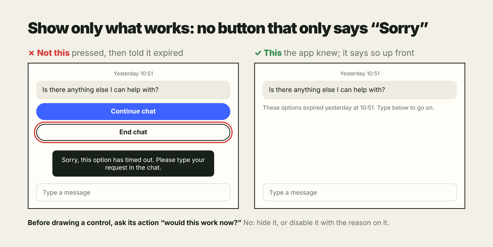

- A rule, its wording still open: do not offer UI elements that are known
  not to work, known in advance.
- For example, there is a button; you press it and it says "sorry, this is
  expired". Then why show it?
- I just ran into it: a support chat, I pressed "End chat" and got such a
  "sorry". That is silly and wrong; such elements should not be shown.
- The implementation is hard, one can only imagine it: an ideal interface
  where every action has a dry run. Before showing something, we run the dry
  run; if it returns false, we do not show it, or we make the button
  disabled with a notice like "expired".

# Show only what works

A control the app already knows will fail is not on the screen. The user
never presses a button to be told it no longer works.

<picture>
  <source media="(prefers-color-scheme: dark)" srcset="dead-controls-dark.png">
  
</picture>

The picture is drawn by [dead-controls.html](dead-controls.html) and
rendered to `dead-controls.png` and `dead-controls-dark.png` (`?dark`).

## Why

A control on the screen is a promise: press me and this happens. When the
app already knows the answer is no, an expired option, a chat that has
ended, an action the user's plan does not include, showing the control
anyway turns the promise into a trap. The user reads it, decides, presses,
and only then learns that none of it was possible. The click is wasted, and
so is the trust: the next button looks just as likely to lie.

A notice after the click is the worst place for the reason. The app knew it
before the click, and the user needed it before deciding.

## The rule

1. **Show only what works.** A control whose action is known to fail is not
   drawn as if it would work: not an expired option, not the button of an
   ended chat, not an action the user has no right to.
2. **Ask the action first: a dry run.** Every action can answer "would it
   work now?" without doing anything. The screen asks before it draws the
   control, and asks again whenever the answer can change: when the option
   expires, when the data under it changes. A button that expires while on
   screen changes at that moment, not on the next click.
3. **No means hidden, or disabled with the reason on it.**
   - Hide what nobody would look for there: the options of a conversation
     that has moved on.
   - Disable what the user expects to find in its place, and write the
     reason on it or beside it: "Expired yesterday at 10:51", "Available
     on the Team plan".
   - Never a control whose only answer is "Sorry" after the click.

The dry run can still be wrong: something may change between the check and
the click. Then the click fails honestly, says why, and the control is
redrawn from the new answer. That is the rare case; a control that fails
every time is not.
